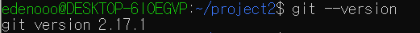
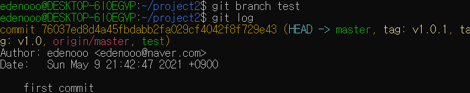

GitHub URL : <https://github.com/edenooo/git-practice>

이 글은 Windows 10의 WSL2(Windows Subsystem for Linux 2) Ubuntu 18.04 LTS 환경에서 테스트한 결과를 바탕으로 작성되었습니다.

# Git 설치 및 시작하기
`sudo apt install git-all` 명령어로 간단하게 git을 설치할 수 있습니다.

`git --version` 명령어로 현재 버전과 정상 설치 여부를 확인할 수 있습니다.

## config 명령어 
Git을 설치하면 가장 먼저 사용자 이름과 이메일 주소를 등록해야 합니다.

아래 사진처럼 `git config` 명령어로 설정할 수 있습니다.

`git config --list` 명령어를 사용하면 설정한 모든 내용을 확인할 수 있습니다.

# 새로운 Git 저장소 만들기
먼저 `project2`라는 기존 디렉토리를 Git 저장소로 만들어 보겠습니다.

`project2` 디렉토리에 이동한 후 진행합니다.

## init 명령어 
`git init` 명령어를 사용하면 현재 디렉토리에 `.git`이라는 하위 디렉토리를 생성합니다.

Git 저장소가 막 생성되었지만, 아직 프로젝트의 어떤 파일도 관리하지 않는 상황입니다.

## add 명령어 
`git add [파일명]` 명령어를 사용해서 Git 저장소가 관리할 파일들을 추가할 수 있습니다.

## commit 명령어 
`git commit -m '커밋메시지'` 명령어를 사용해서 커밋을 할 수 있습니다. 여기서 `-m` 옵션을 붙이면 vim에서 별도로 메시지 작성을 할 필요가 없어집니다.

## clone 명령어 
`git clone [GitHub 링크]` 명령어를 사용해서 기존에 존재하던 다른 Git 저장소를 복사해올 수 있습니다.

이제 새로운 git 저장소의 준비가 끝났으니, 본격적인 버전 관리를 시작하겠습니다.

# Git 저장소 조회하기

## status 명령어 
`git status` 명령어를 사용해서 현재 파일들의 상태를 확인할 수 있습니다.

아직 파일을 하나도 수정하지 않았기 때문에 별다른 내용이 없습니다.

## log 명령어 
`git log` 명령어를 사용해서 저장소의 히스토리를 조회할 수 있습니다.

아까 전에 커밋했던 first commit이 보입니다.

유용한 옵션으로 `-p`가 있는데, 각 커밋에 적용된 패치를 보여줍니다.

## tag 명령어 
`git tag [태그명]` 명령어로 태그를 붙일 수 있습니다.

`-a` 옵션을 붙이면 더 자세하게 붙일 수 있습니다.

별다른 옵션을 붙이지 않으면 Lightweight 태그, `-a` 옵션을 붙이면 Annotated 태그라고 부릅니다.

`git tag` 명령어로 태그 정보를 조회할 수 있습니다.

# 리모트 저장소 관리하기

## remote 명령어 
`git remote add [단축이름] [GitHub 링크]` 명령어를 사용해 리모트 저장소를 등록할 수 있습니다. 다른 사람들에게 공유되는 리모트 저장소를 통해 push나 pull 등을 하면서 함께 일할 수 있습니다.

`git remote` 명령어로 리모트 저장소가 잘 등록되어 있는지 확인할 수 있습니다.

`-v` 옵션을 붙이면 단축이름과 GitHub 링크도 표시해줍니다.

## push 명령어 
`git push [리모트 저장소 이름] [브랜치 이름]` 명령어로 리모트 저장소에 프로젝트를 공유할 수 있습니다.

## pull 명령어 
`git pull [리모트 저장소 이름] [브랜치 이름]` 명령어로, 리모트 저장소의 변경 내역을 프로젝트로 가져올 수 있습니다.

# Git 브랜치 관리하기
브랜치는 Git의 가장 큰 장점 중 하나로, 모든 버전 관리 시스템은 브랜치를 지원합니다. 브랜치를 여러 개 만들면 서로 다른 버전의 코드들을 독립적으로 개발할 수 있는데, 이렇게 개발하다가 브랜치들 사이를 이동하거나 여러 브랜치를 합치는 등 자유로운 활용이 가능합니다.

## branch 명령어 
`git branch [브랜치 이름]`으로 새로운 브랜치를 생성할 수 있습니다.

기존의 master 브랜치에서 새로운 'second commit' 커밋을 하더라도 test 브랜치는 'first commit'에서 멈춰 있습니다.

## checkout 명령어 
`git checkout [브랜치 이름]`으로 이미 존재하던 다른 브랜치로 이동할 수 있습니다.

test 브랜치에서 새로운 'third commit' 커밋을 해도 master 브랜치에는 변화가 없습니다. 이런 식으로 브랜치들마다 독립적인 개발을 할 수 있습니다.

현재 브랜치들의 모습은 다음과 같습니다.

## merge 명령어 
`git merge [현재 브랜치에 합칠 브랜치 이름]` 명령어로 다른 브랜치와 합칠 수 있습니다.

현재 브랜치들의 모습은 다음과 같습니다.

## rebase 명령어 
조금 더 깔끔하게 합치는 방법으로 rebase가 있습니다. rebase나 merge나 최종 결과물은 같지만, 커밋 히스토리의 형태만이 다릅니다.

`git rebase [현재 브랜치에 합칠 브랜치 이름]` 명령어로도 다른 브랜치와 합칠 수 있습니다.

현재 브랜치들의 모습은 다음과 같습니다.

# Git 저장소 되돌리기

## reset 명령어 
버전 관리를 하다 보면 커밋을 되돌리고 싶은 상황이 발생할 수도 있습니다.

`git reset --hard [커밋 이름]` 명령어로 원하는 커밋 위치까지 돌아갈 수 있습니다.

'seventh commit'의 내용이 되돌려진 것을 확인할 수 있습니다.

# git 명령어 사용 표

| 명령어 | 사용 여부 | 명령어 설명 링크 |
| - | - | - |
| add | O | [add](#add) |
| branch | O | [branch](#branch) |
| checkout | O | [checkout](#checkout) |
| clone | O | [clone](#clone) |
| commit | O | [commit](#commit) |
| config | O | [config](#config) |
| init | O | [init](#init) |
| log | O | [log](#log) |
| merge | O | [merge](#merge) |
| pull | O | [pull](#pull) |
| push | O | [push](#push) |
| rebase | O | [rebase](#rebase) |
| remote | O | [remote](#remote) |
| reset --hard | O | [reset](#reset) |
| status | O | [status](#status) |
| tag | O | [tag](#tag) |